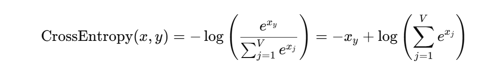
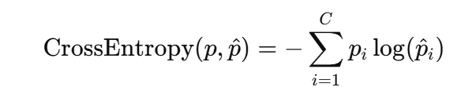
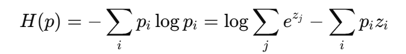

写了cross-entropy和entropy，公式不算复杂且这块不太熟，总结下。

## cross-entropy使用

cross-entropy为模型输出求loss
``` py
# 输入
logits # [batch, vocab] 未归一化的模型输出
target # [batch, ] 类别
# 1数值稳定性问题 
logits_stable = logits - logits.max(dim=-1, keepdim=True).values

# 2计算logsumexp
# 3正确标签的logit_stable
target_logits = input_stable[torch.arange(batch_size), targets]
# 4带入公式相加并且求平均
```

交叉熵能衡量预测分布与真实分布的距离。因为这里真实的分布是出了标签是1就全是0，所以约成了最初的公式。

## entropy使用
用来衡量生成token的不确定性。

这里同样要注意数值稳定性，注意不是把数值变成-max的版本就行的，因为logsumexp分母，所以需要加上最大值作为补偿。